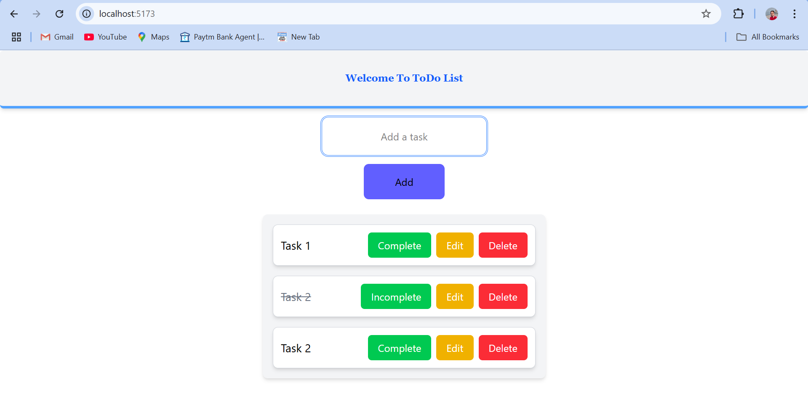

# React + Vite


# To-Do List Application

## 📌 Overview
A simple and responsive To-Do List application built with **React** and **Tailwind CSS**. Users can **add, edit, mark complete, and delete tasks** efficiently.

## 🚀 Features
- Add new tasks.
- Edit existing tasks.
- Mark tasks as completed/incomplete.
- Delete tasks.
- Simple and clean UI.

## 🛠️ Installation & Setup
### Prerequisites:
Make sure you have the following installed:
- [Node.js](https://nodejs.org/) (Latest LTS version recommended)
- [npm](https://www.npmjs.com/) or [yarn](https://yarnpkg.com/)

### Steps:
1. **Clone the repository**:
   ```bash
   git clone https://github.com/amar-jeet-9494/ToDoList.git
   cd TO-DO-LIST

2. **Install dependencies**:
    npm install


3. **Start the development server**:
    npm run dev

4. **Open the app**:
    - The application will start on (http://localhost:5173/).




This template provides a minimal setup to get React working in Vite with HMR and some ESLint rules.

Currently, two official plugins are available:

- [@vitejs/plugin-react](https://github.com/vitejs/vite-plugin-react/blob/main/packages/plugin-react) uses [Babel](https://babeljs.io/) for Fast Refresh
- [@vitejs/plugin-react-swc](https://github.com/vitejs/vite-plugin-react/blob/main/packages/plugin-react-swc) uses [SWC](https://swc.rs/) for Fast Refresh.